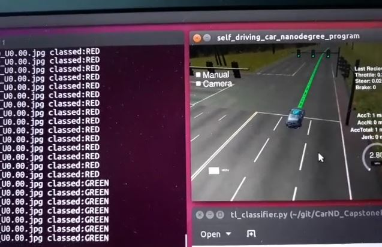

[projectLogoImage]: data/SmartCarlaProjectLogo.jpg "1"

![Alt text][projectLogoImage]

# SmartCarla. System Integration (Capstone) Project

Udacity Self-Driving Car Engineer Nanodegree Program   

Version: 1.0   

Date: 03Aug2018 </pre>

# Table of contents

1. [Team](#team) 
2. [Abstract](#abstract)
3. [Submission checklist](#checklist)
4. [Required set-up](#setup)
5. [Waypoint processing](#waypointProcessing)
6. [Drive-by-wire controls](#dbwControls)
7. [Training image capture](#trainingImageCapture)
   1. [Simulation images](#simulationImages)
   2. [Real images](#realImages)
8. [Image classifier and results: Faster R-CNN](#fasterRCNN)
    1. [Tensorflow object detection API](#fasterRCNNTensorflow) 
    2. [Model setup and training](#fasterRCNNModelSetup)
    3. [Running instructions](#fasterRCNNInstructions)
    4. [Issues](#fasterRCNNIssues)
    5. [Results](#fasterRCNNResults)
    6. [Hardware](#fasterRCNNHardware)
9. [Image classifier and results: VGG](#vgg)
10. [Summary](#summary)

## Team SmartCarla <a name="team"></a>

|      Name  |          Email |    Responsibilities |
|:------------:|:------------:|:-----------:|
| Sergey Iakovlev | siakovlev@studnet.unimelb.edu.au |  Team lead/Faster R-CNN classifier |
| Tatsuya Hatanaka | tatsuya.hatanaka@gmail.com | Data preparation, Smooth braking |
| Swapan Shridhar  | available365.24.7@gmail.com  | Twist Controller, car wobbling issues, logo |
| Anthony T Tran   | iamtran@hotmail.com          | Collecting Images for training Classifier/Testing                                                  |
| Charlie Wartnaby | charlie.wartnaby@idiada.com | Auto simulation training image capture/VGG classifier |


## Abstract <a name="abstract"></a>

This is the project repo of **Smart Carla team** for the final project of the Udacity Self-Driving Car Nanodegree in which we programed a real self-driving car.

The goal of the project was to get **Udacity's self-driving car** to drive around a test track while avoiding obstacles and stopping at traffic lights.

The starting code has been taken from Udacity's github repository [here](https://github.com/udacity/CarND-Capstone).


## Submission checklist <a name="checklist"></a>

This section describes how each of the required checklist items have been met
for project submission.

[CW: by having a sentence or two for each of these, we should make it really
easy for the Udacity assessor to see we've done everything we are supposed to.
**TODO no description of how we have tested or met these, does it matter I wonder?**]

* [x] **Launch correctly using the launch files provided in the capstone repo**

* [x] **Smoothly follow waypoints in the simulator**

* [x] **Respect the target top speed set for the waypoints**

* [x] **Stop at traffic lights when needed**

* [x] **Stop and restart PID controllers depending on the state of /vehicle/dbw_enabled**

* [x] **Publish throttle, steering, and brake commands at 50 Hz**

* [x] **Test it out using ROS bags that were recorded at the test site**


## Required set-up <a name="setup"></a>

As required by Udacity, no additional Python packages or other libraries are required to
run the software. The list of packages installed by the provided `requirements.txt` (but with
`tensorflow-gpu` instead of `tensorflow`) is adequate.

The light classifier has three possible settings. Each will cause the download of
one or more large pretrained neural network model files on first use, because those files were too large to
include in the GitHub repository. The possible settings in `tl_classifier.py` are:

| Options           | Description    |
|:-----------------:|:--------------------:|
| `self.classifier = "FRCNN"`, `self.is_site = False` | Default: F-R-CNN, for simulator use |
| `self.classifier = "FRCNN"`, `self.is_site = True` | F-R-CNN, for vehicle/real image use |
| `self.classifier = "VGG"` | VGG, for simulator use only (less good, see notes below) |

This initial download may cause the tl_detector process (which imports tl_classifier) to
time out the ROS launch overall. For the VGG case, you can execute
`ros/run_this_first_to_download_big_model_files.sh` first to avoid this ROS timeout.


## Waypoint processing <a name="waypointProcessing"></a>

Updated `wayoint_follower` pure_pursuit_core.h params `displacement_threshold`, `relative_angle_threshold` to `0.1` and `1.0` respectively, to enable fine grained check in `PurePursuit::verifyFollowing()` for the waypoints. This helps in fixing car's wandering around the waypoints, when zoomed in. Thus, smooth following of waypoints.

## Drive-by-wire controls <a name="dbwControls"></a>

Subscribes to `/current_velocity`, `/twist_cmd` and `/vehicle/dbw_enabled`. Checks if dbw_enabled is True and then publishes throttle, brake and steer values using `PID` controller, for the simulator.

## Training image capture <a name="trainingImageCapture"></a>

Automatic collection of images for classifier training purposes was added to `tl_detector.py`.
This collected images from the `/image_color` topic, either from the simulator (acting as a
virtual camera sensor), or from playing one of the Udacity-provided .bag files with real
images.

The images were captured if `self.grab_training_images` (normally False) was set True. The
files were automatically named and numbered (using `self.training_image_idx`). However, The
strategy for collecting simulator or real images then differed.

The end result was a collection of images named e.g. `sim_123_0.jpg` (for the 123rd simulator
image of state 0=RED) or `real_124_2.jpg` (for the 124th real image of state 2=GREEN). These
images could then be read into the training programs directly and the ground truth state
extracted easily from the filename suffix. The training images can be found in the
`data/training_images*` folders.

### Simulation images <a name="simulationImages"></a>

The simulator provided ground truth light states (colours) alongside the images, so
we wrote code in `tl_detector.py` to automatically name the saved image files with the
required ground-truth suffix number, requiring no manual work.

To collect a useful set of images without capturing near-identical images, or many
images of light-free roads, logic was included as follows:
1. Images were captured only if the car was within `self.sim_image_grab_max_range` metres of a light,
   to avoid pictures of empty road.
2. Image capture stopped below `self.sim_image_grab_min_range` of a light, assuming it
   would be passing out of the camera frame when very nearby.
3. Another image would not be captured if the car was still within `self.sim_image_grab_min_spacing`
   metres of the point at which the last image was captured.

The car was then allowed to drive round the circuit in simulation and images were
accumulated. 285 were collected initially in `data/training_images`; this was perfectly adequate for training
the classifiers, as the simulation images were relatively easy to identify by
a DL model.

Additional simulation images were later captured as `data/training_images2`.

### Real images <a name="realImages"></a>

All the real images were obtained from Udacity .bag files.

The first images were obtained by automatic saving in `tl_detector.py` from
`traffic_light_training.bag` (linked to in the start project repo `README.md` file).
However, these images were of poor quality, with excessive brightness and poor
colours. Even as a human it was difficult to distinguish the colour; in some cases
it could only be determined by looking at the reflection on the car bonnet (hood).
Also, the difficulty in training a classifier on these poor images meant that we
needed more pictures.

In the second step, we used the `rviz` ROS package. The following tutorial from ROS webpage
(http://wiki.ros.org/rosbag/Tutorials/Exporting%20image%20and%20video%20data)
describes how to create a new `.launch` file and automatically capture images. Furthermore
the file `just_traffic_light.bag` linked to on the project submission page of the
classroom was used, which proved to have better-quality images.

## Image classifier and results: Faster R-CNN <a name="fasterRCNN"></a>

### Tensorflow object detection API<a name="fasterRCNNTensorflow"></a>
One way to build a classifier is to use a powerfull API from Tensorflow on Object Detection. It has many pre-trained networks that can be fine tuned using custom datasets. There are several good tutorials that cover main steps and were used by our team as references in this project:
  - by Daniel Stang: [link](https://medium.com/@WuStangDan/step-by-step-tensorflow-object-detection-api-tutorial-part-1-selecting-a-model-a02b6aabe39e)
  - by Vatsal Sodhal [link](https://becominghuman.ai/tensorflow-object-detection-api-tutorial-training-and-evaluating-custom-object-detector-ed2594afcf73)
  - by Dat Tran: [link](https://towardsdatascience.com/how-to-train-your-own-object-detector-with-tensorflows-object-detector-api-bec72ecfe1d9)

As a pre-trained classifier, we chose the Faster R-CNN network ([link](https://arxiv.org/pdf/1504.08083.pdf)) that incorporates a ResNet 101 pretrained model. It provides a good balance between speed and detection accuracy for small objects on the image. In particular, we did not choose SSD (Singe Shot Detector) network as it resizes any input image to 300x300 pixels and, therefore, the accuracy of detecting small objects is reduced. The summary of main speed characteristics for different object detectors can be found [here](https://github.com/tensorflow/models/blob/master/research/object_detection/g3doc/detection_model_zoo.md).

### Model setup and training <a name="fasterRCNNModelSetup"></a>
Once the data was ready the following steps were taken to get classifier working:
  - Follow installation instructions for object detection api: [link](https://github.com/tensorflow/models/blob/d1173bc9714b5729b8c95d8e91e8647c66acebe6/object_detection/g3doc/installation.md)
  - Draw boxes and give a corresponding label (`red`, `yellow` or `green`) for each image in the dataset. We used [labelImg](https://github.com/tzutalin/labelImg) to do this.
  - Create `.pbtxt` file with labels data. See [](link)
  - Create `.record` file. To do this we adopted code from the original [`create_pascal_tf_record.py`](https://github.com/tensorflow/models/blob/d1173bc9714b5729b8c95d8e91e8647c66acebe6/object_detection/create_pascal_tf_record.py). The modified version of the script can be found here: [tf_record_udacity.py](link)
    Usage example:
    ```bash
    python tf_record_udacity.py \
          --data_dir=/home/user/data \ # dataset path
          --output_path=/home/user/udacity_data.record \ # output .record file path
          --label_map_path=/home/user/data/label_map.pbtxt # label .pbtxt file path
    ```
  - Configure the model parameters, trainig and validation setting using corresponding `.config` file. See `faster_rcnn_resnet101_udacity.config` for details.
  - Run `train.py` script, specify model configuration file and output directory. Usage example:
    ```bash
    python train.py --logtostderr --train_dir=./models/train --pipeline_config_path=faster_rcnn_resnet101_udacity.config
    ```
  - Run `export_inference_graph.py` script, specify model configuration file, checkpoint file (`.ckpt`) and output directory for a frozen graph. Usage example:
    ```bash
    python export_inference_graph.py --input_type image_tensor \
    --pipeline_config_path ./faster_rcnn_resnet101_udacity.config \
    --trained_checkpoint_prefix ./models/train/model.ckpt-10000 \
    --output_directory ./fine_tuned_model
    ```

### Running instructions <a name="fasterRCNNInstructions"></a>

- The flag `is_site` (inside `tl_classifier.py` line 16) is used for switching between two types of classifiers: one is based on simulator images and another is a real images classifier.
- Once code is running the required model is automatically downloaded and configured. The user will see corresponding messages signifying that classifier was set up successfully. To run the code, GPU enabled machine is required.

### Issues <a name="fasterRCNNIssues"></a>

- Back compatibility with Tensorflow 1.3 as required by Udacity. The current version of object detection API is based on 1.9 tensorflow and not compatible with 1.3. Instead we used an older version from this [commit](https://github.com/tensorflow/models/tree/d1173bc9714b5729b8c95d8e91e8647c66acebe6).

### Results <a name="fasterRCNNResults"></a>

The following picures demonstrate traffic lights classifier performance for two different classes of images:

- real images taken from `just_traffic_light.bag`:
  <p float="left">
      
      
      
  </p>
- simulator images:
  <p float="left">
      
      
      
  </p>
Note that classifier score is always above 90.

The videos below show

- classifier performance in the simulator (by Udacity):

  [](https://youtu.be/n33BJwhKeUU)

- classifier performance for the `just_traffic_light.bag` file (by Udacity):

  [](https://youtu.be/I5Ab-Io5ETI)


### Hardware <a name="fasterRCNNHardware"></a>

Tests were conducted using Nvidia GTX1070 8GB, i7-7700HQ.

## Image classifier and results: VGG <a name="vgg"></a>

Two methods of classification were attempted in parallel, and overall the Faster R-CNN approach
above was successful. However, a full-frame classifier based on the pretrained VGG network
was also attempted, which is described here. This was good enough to work in the simulator,
but not with real camera images taken from Carla.

The VGG classifier can be invoked as an option by setting `self.classifier = "FRCNN"` in 
`tl_classifier.py`. Most of the related work is in these separate source files however,
which were initially based on one of our submissions for the Semantic Segregation project:

1. `/training/cnn_classifier_model.py` sets up the model in TensorFlow both for training
   and run-time inference. This common code ensures that the same structure is set up in
   both cases, so that the loaded weights remain compatible.
2. `/training/main.py` invokes the model in training mode. 
3. `/training/helper.py` contains some common utilities, including loading the training
   images from disk into a Numpy array (using a generator function for memory efficiency),
   obtaining the correct ground truth classifications from the filename suffix.

Most recently the model was trained on
the original set of 185 simulator and 101 real images in `data/training_images`. The
raw command-line output is retained in `ros/src/tl_detector/runs/1532796265.11/output.txt`
(the location the now-pretrained weights are downloaded to on first execution). As
explained previously those first real images were from the `traffic_light_training.bag`
file which proved to be of low quality compared with the `just_traffic_light.bag`
introduced only later in the classroom. In practice the model trained itself mainly
to classify simulator images, which it did successfully.

The structure was as follows:

| Raw image input |
|:---------------:|
| Resize to (8 x 32, 11 x 32) pixels to fit memory overall (multiples of 32 because of 5 halving steps) |
| Standard VGG network |
| Flattening |
| Fully connected, reduced to depth 32 (maximum to fit GPU memory) |
| Fully connected, reduced to depth 4 (required output classes) |

The key addition of custom layers is implemented here in `training/cnn_classifier_model.py`:
```
flat_cw = tf.reshape(self.layer7_out, [-1,final_rows*final_cols*4096], name="flat_cw")
dense_cw = tf.layers.dense(inputs=flat_cw, units=32, activation=tf.nn.relu, name="dense_cw")
final_layer_cw = tf.layers.dense(inputs=dense_cw, units=self.num_classes, name="final_layer_cw")
```

Training end-to-end was not very successful. The intial training set was too small to
train such a large model. However, freezing the VGG weights and training only the custom
fully connected layers worked.

 
Training was later attempted using the larger set of real images in `data/training_images3`,
but the model failed to classify these effectively. Given the success of the Faster R-CNN approach,
it was not pursued further.

This short video shows the VGG classifier successfully running the car in simulation
(with audio narrative):

  [](https://youtu.be/xVj-Mr-K_Ek)


## Other sections I've forgotten about

## Summary <a name="summary"></a>

[CW: discuss possible imporvements that could be made]
